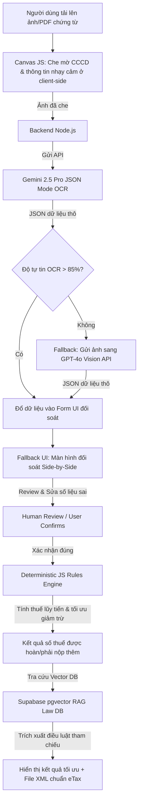

# 2 — FINAL: Solution Approach + Demo/Mockup/Flow

Mục tiêu: chốt cách làm cho Quick Win (Build / Buy / Boost / Partner), nói rõ data & ai review cần có, và tạo 1 bản vẽ trực quan để stakeholder *nhìn* được. Đây là nửa "siết lại" của [Double Diamond](https://www.thefountaininstitute.com/blog/what-is-the-double-diamond-design-process) vòng 2 và là bản nộp của phase Solution.

Lý do làm bước này: hai cái bẫy. Một, "tự build" cho oai — trong khi 80–90% nhu cầu nội bộ chỉ cần Boost/Buy; tự build là quyết định khó rút lại nhất. Hai, chỉ nói bằng chữ — stakeholder không duyệt một đoạn văn, họ duyệt khi *nhìn thấy* flow. Không có bản vẽ → trượt Gate 4 dù lập luận tốt.

Quy tắc: **bản vẽ trực quan là BẮT BUỘC; demo chạy được chỉ là điểm cộng.** *Demo đơn giản + lập luận chặt > demo đẹp + lập luận yếu.*

## Quy trình 12 phút

```text
4 phút  — Phần A: chốt Build/Buy/Boost/Partner (decision tree + ego check)
3 phút  — Phần B: data & ai review cần có
5 phút  — Phần C: vẽ 1 artifact trực quan + đánh dấu chỗ người review
```

---

## Phần A — Chốt cách làm

Đi decision tree, đừng chọn theo cảm giác:

```text
Bài này có phải LỢI THẾ CẠNH TRANH CỐT LÕI không?
 ├─ CÓ  → đội có AI engineer mạnh? CÓ → Build · KHÔNG → Boost
 └─ KHÔNG (chỉ là productivity layer) → có tool sẵn?
          CÓ → Buy · KHÔNG → Boost (model sẵn + data riêng)
```

Câu hỏi phụ:

- Nhóm chọn cách này vì *cần* hay vì *thích tự build*? Một câu thành thật.
- Hướng nào ở file `1` (đã tìm được người làm rồi) khớp với cách này — "đi từ 5 lên"?

### Trả lời

- **Cách làm chốt**: **Boost** (Tận dụng mô hình đa phương thức Gemini 2.5 Pro Multimodal API sẵn có + Kết hợp logic lập trình Code Rules Engine nội bộ + Thiết lập RAG trên Vector DB chứa luật thuế TNCN mới).
- **Lý do CẦN (không phải thích), 2–3 câu**: Chúng tôi CẦN sử dụng mô hình **Boost** để giải quyết triệt để hai bài toán đối nghịch: OCR dữ liệu chứng từ cực kỳ linh hoạt bằng Gemini Vision API và tính toán số thuế chính xác 100% bằng code JS deterministic thuần túy (rules engine). Việc tính thuế bắt buộc phải chính xác và không được phép để AI tự tính nhẩm để tránh ảo giác số học (hallucination). Đồng thời, việc tận dụng API Gemini 2.5 Pro giúp xử lý trích xuất chứng từ đa cấu trúc mà không phải đầu tư hàng trăm triệu tự xây dựng mô hình OCR từ đầu.
- **Vì sao KHÔNG "Build từ số 0"**: Việc xây dựng và gán nhãn hàng chục nghìn chứng từ thuế TNCN thực tế tại Việt Nam để tự huấn luyện một mô hình OCR riêng biệt đòi hỏi chi phí phần cứng và thời gian khổng lồ (vượt quá ngân sách pilot 10.000.000 VNĐ và quỹ thời gian 14 ngày).
- **Tool / API / vendor cần + ước lượng chi phí thô** (budget nhỏ, ưu tiên sẵn có):
  1. **Primary AI API**: Google Vertex AI - Gemini 2.5 Pro API ($1.25/1M input tokens. Ước tính chi phí pilot cho 1.000 chứng từ $\approx$ 500.000 VNĐ).
  2. **Backup AI API**: OpenAI GPT-4o API (Làm fallback OCR khi điểm tin cậy OCR của Gemini < 85%. Ước tính $\approx$ 300.000 VNĐ).
  3. **Database & Hosting**: Supabase (Database + pgvector miễn phí), Vercel Pro Hosting ($20/tháng $\approx$ 500.000 VNĐ).
  4. **Marketing & Ads**: Hyper-targeted Facebook Ads để tiếp cận 100 Freelancers ($\approx$ 1.500.000 VNĐ).
  *Tổng chi phí ước lượng tối đa cho pilot 14 ngày: ~2.800.000 VNĐ (Rất an toàn so với budget 10.000.000 VNĐ).*

## Phần B — Data & ai review (cách làm này cần gì để chạy được)

| Cần gì | Có sẵn trong AI20k? | Trong lab dùng (mẫu/giả định) | Privacy? |
|---|---|---|---|
| **Data 1**: 50 Chứng từ khấu trừ thuế TNCN (Mẫu 03/TNCN) thực tế của Việt Nam | Không (Do dữ liệu tài chính cá nhân nhạy cảm, không có sẵn công khai). | Nhóm tự tạo 50 mẫu chứng từ giả định (đầy đủ các mẫu giấy tự in, mẫu điện tử mới, đã che mờ/thay thế bằng số liệu kiểm thử ngẫu nhiên). | **Cực kỳ nhạy cảm**. Phải dùng Canvas JS bôi đen (masking) CCCD và Địa chỉ tại client-side trước khi gửi lên API. Xóa ảnh vĩnh viễn trên RAM server sau khi kết thúc session OCR. |
| **Data 2**: Cơ sở dữ liệu Luật thuế TNCN mới (Nghị định 310/2025/NĐ-CP & Thông tư 111/2013) | Không có sẵn trong repo. | Tải file PDF luật chính thức từ Thư Viện Pháp Luật và nạp vào Supabase Vector DB làm RAG. | **Không nhạy cảm** (Dữ liệu văn bản luật công khai công chúng). |

- **Output nào rủi ro cao** (sai gây hậu quả): Con số **Tổng thu nhập chịu thuế** và **Số tiền thuế đã khấu trừ** do AI trích xuất. Nếu hai con số này bị sai lệch dù chỉ 1 chữ số, công thức tính toán sẽ kết xuất ra file tờ khai XML sai lệch nghiêm trọng, khiến cơ quan thuế từ chối và phạt nộp chậm/khai sai đối với người dùng (theo Nghị định 310/2025/NĐ-CP).
- **Ai review + bao nhiêu mẫu + pass/fail theo gì**: **Người nộp thuế (User) trực tiếp review 100% hồ sơ quét** thông qua giao diện đối soát song song (Side-by-side Fallback UI). 
  - *Tiêu chuẩn Pass*: Số liệu AI điền vào form trùng khớp 100% với ảnh chụp chứng từ hiển thị song song bên cạnh. Nếu sai lệch, người dùng tự gõ sửa lại số liệu trực tiếp trên ô nhập liệu. Hệ thống chỉ thực hiện tính toán và xuất XML sau khi người dùng nhấn nút "Xác nhận số liệu đúng".
- **Có cần citation / nói "không biết" khi thiếu nguồn không**: **Cực kỳ cần thiết**. Chatbot tư vấn giảm trừ gia cảnh phải trích dẫn rõ Điều, Khoản của Nghị định 310/2025/NĐ-CP để tạo tính xác thực pháp lý. Nếu hồ sơ người phụ thuộc rơi vào trường hợp quá đặc biệt nằm ngoài Vector DB, AI bắt buộc phải trả lời: *"Tôi không có đủ thông tin pháp lý cho trường hợp đặc biệt này của bạn, vui lòng liên hệ chi cục thuế hoặc kế toán chuyên nghiệp để được tư vấn chính xác nhất"*.

## Phần C — Bản vẽ trực quan (BẮT BUỘC)

Nhóm xây dựng bản vẽ thiết kế hệ thống (System Architecture) kết hợp giao diện đối soát số liệu (Side-by-side Fallback UI Mockup) trực quan để stakeholder nắm bắt trong 20 giây:

### 1. Sơ đồ Luồng Kỹ Thuật Hệ Thống (System Architecture Flow)



### 2. Giao diện Màn hình Đối soát (Side-by-Side Fallback UI Mockup)

```text
+-----------------------------------------------------------------------------------+
|  🤖 AI INCOME TAX ASSISTANT - GIAO DIỆN TỰ QUYẾT TOÁN THUẾ TNCN                   |
+-----------------------------------------------------------------------------------+
|  [ BƯỚC 1: TẢI CHỨNG TỪ ] -> [ BƯỚC 2: ĐỐI SOÁT SỐ LIỆU ] -> [ BƯỚC 3: XUẤT KẾT QUẢ]  |
+-----------------------------------------------------------------------------------+
|                                                                                   |
|  ⚠️ BƯỚC 2: ĐỐI SOÁT SỐ LIỆU (FALLBACK UX - HUMAN REVIEW)                           |
|  Vui lòng đối chiếu số liệu AI quét được bên phải với chứng từ gốc bên trái.       |
|                                                                                   |
|  +---------------------------------------+  +----------------------------------+  |
|  | CHỨNG TỪ GỐC (ẢNH CHỤP ĐÃ MASK CCCD)  |  | SỐ LIỆU AI TRÍCH XUẤT (SỬA ĐƯỢC) |  |
|  |                                       |  |                                  |  |
|  |   MST Công ty: 0102030405             |  |  [1] MST Doanh nghiệp chi trả:   |  |
|  |   Thu nhập chịu thuế: 120,000,000đ    |  |      | 0102030405             |  |  |
|  |   Thuế đã khấu trừ:    12,000,000đ    |  |  [2] Tổng thu nhập chịu thuế:    |  |
|  |   [ CCCD: XXXXXXXXXXXX (ĐÃ CHE) ]     |  |      | 120,000,000            |  |  |
|  |                                       |  |  [3] Số thuế đã khấu trừ (10%):  |  |
|  |                                       |  |      | 12,000,000             | <=== GIỮ VAI TRÒ
|  |                                       |  |                                  |   HUMAN REVIEW
|  |                                       |  |  [4] Số người phụ thuộc giảm trừ: |   CHÍNH!
|  |                                       |  |      | 1                      |  |   (Sửa đổi nếu
|  |                                       |  |                                  |    AI OCR sai)
|  +---------------------------------------+  +----------------------------------+  |
|                                                                                   |
|  +-----------------------------------------------------------------------------+  |
|  |  🤖 AI TƯ VẤN: "Dựa trên Nghị định 310/2025/NĐ-CP, bạn có 1 người phụ thuộc    |  |
|  |  (mức giảm trừ 4.4M/tháng). Tổng số thuế TNCN được hoàn dự kiến: 4.400.000 VNĐ|  |
|  +-----------------------------------------------------------------------------+  |
|                                                                                   |
|                      [ QUAY LẠI ]                 [ XÁC NHẬN & TÍNH TOÁN ]        |
|                                                                                   |
+-----------------------------------------------------------------------------------+
```

- **Chỗ con người review (output rủi ro cao) nằm ở**: Bước **Human Review / User Confirms** tại Màn hình Đối soát (Side-by-Side Form). Người dùng trực tiếp rà soát số tiền Thu nhập và số Thuế đã khấu trừ, chỉnh sửa các lỗi sai OCR của AI trên Form nhập liệu trước khi nhấn nút "Xác nhận & Tính toán" để kích hoạt Rules Engine. Điều này đảm bảo an toàn tuyệt đối 100% về mặt số liệu tài chính trước khi xuất tờ khai XML.

Câu hỏi phụ — một người đóng vai stakeholder nhìn 20 giây: *hiểu user làm gì, nhận lại gì, không cần giải thích thêm không? Có chỗ nào "đẹp nhưng rỗng" không?*

---

## Tổng kiểm tra trước khi sang `../03-pilot-plan/`

| Hạng mục | Xong? |
|---|---|
| Cách làm có lý do CẦN, không phải "mặc định tự build" | / |
| Nói rõ data cần + ai review output rủi ro cao | / |
| Có ≥1 bản vẽ trực quan, người ngoài hiểu trong ~20 giây | / |
| Có đánh dấu chỗ con người review | / |

⚑ Coach kiểm tra ở Mốc 3: *"Stakeholder nhìn vào đâu để hiểu flow? Mockup/sketch/demo đâu?"* Chỉ nói bằng chữ = chưa qua.

Sau bước này, mở `../03-pilot-plan/1-pilot-plan.md`.

*Liên quan: handbook §A5+§A6 · `templates/demo-examples.md` · `prompts/05-demo-challenge.md`*
